= Duplicating Geometry with the clone Command
BRL-CAD Team <devs@brlcad.org>
:doctype: article
:toc:
:toclevels: 3

[[clone_intro]]
== Introduction

The `clone` command is BRL-CAD's workhorse for producing structured
copies of geometry.  Whether you need a single mirrored part, a row of
identical fasteners, a three-dimensional rectangular grid of bolt
holes, a ring of rotor blades, or a full hemisphere of sensor
positions, `clone` handles it all from a single command with a
consistent, composable set of options.

This article walks through each pattern mode with rendered examples
drawn from BRL-CAD's canonical sample models — the
https://github.com/starseeker/brlcad_quickiterate[havoc] Apache
helicopter and the multi-primitive *moss* scene — so you can see
exactly what each option produces before you commit it to your own
database.

Every session below is shown as it would appear in the *MGED* command
window.  The same commands work identically in *ged_exec* or any
other BRL-CAD command processor.

[[clone_concepts]]
== Core Concepts

=== What clone actually creates

When `clone` runs it deep-copies the named object hierarchy (to the
depth you request) and places each copy at a computed position by
embedding a placement matrix into the copy's parent combination.  The
original source object is *not* moved or modified; it stays exactly
where it was, and the first new copy is placed at position 1 in the
naming sequence.

[NOTE]
====
`clone` is not `cp`.  `cp` makes one extra copy at a user-specified
name.  `clone` makes _N_ copies at automatically computed positions and
automatically generated names, all in one step.
====

=== Automatic naming

`clone` looks for the first embedded number in the source object's
name and increments it by *100* (the default) for each copy.  A source
named `wheel.r` produces `wheel.r100`, `wheel.r200`, and so on.  If
there is no embedded number, the increment is appended: `lid`
→ `lid100`, `lid200`, …

The `-i` option overrides the increment:

----
clone -i 1 -n 4 -t 10 0 0 bolt.r
----

produces `bolt.r1`, `bolt.r2`, `bolt.r3`, `bolt.r4` — a naming style
that is cleaner when the source already carries a numeric suffix and
you want sequential integers.

The `-c` option (repeatable) advances the naming cursor to the _next_
embedded number, so you can target the second or third number in a
compound name.

=== Copy depth: top, regions, and primitives

The `--depth` option controls how much of the source hierarchy is
actually duplicated:

[cols="1,3"]
|===
|Value |Behaviour

|*top* (default for patterns)
|Creates a lightweight wrapper combination that references the original
geometry through a matrix.  No geometry is copied; only the positioning
is new.  This is the fastest mode and consumes the least disk space.
Shared changes to the original (material colours, vertex edits) are
immediately reflected in every clone.

|*regions*
|Copies every combination from the tree root down to (and including)
the first region on each path.  Primitives below the region boundary
are shared.  New region identifiers are assigned so that raytracing
treats each copy as a distinct target.  Use this when you need
independent region attributes (material, ident) but do not mind
sharing primitive shapes.

|*primitives*
|Performs a full recursive deep copy of the entire hierarchy down to
individual primitive shapes, baking the placement matrix directly into
each primitive's parameters.  Each copy is entirely independent.  This
is the most expensive mode but produces the most self-contained result.
====

For a single-copy linear invocation (the default when `-n` / `-t` are
not given), the default depth is *primitives*, preserving the
historical behaviour of the frozen linear API.  For all pattern modes
and multi-copy linear uses the default is *top*.

[[clone_linear]]
== Linear Cloning

Linear cloning is the original `clone` mode and is the default when no
pattern keyword is given.  It produces copies spaced along a direction
vector you control.

=== Per-copy translation: -t

The simplest linear invocation translates each copy by a fixed vector:

----
clone -n 2 -t 0 2200 0 havoc
----

This makes two copies of `havoc`, each displaced 2,200 mm along the Y
axis from the previous copy.  The original `havoc` is unchanged; the
new copies are named `havoc1` and `havoc2` (or with `havoc100` and
`havoc200` at the default increment of 100).

.Three Havoc helicopters in linear formation (original + 2 clones).
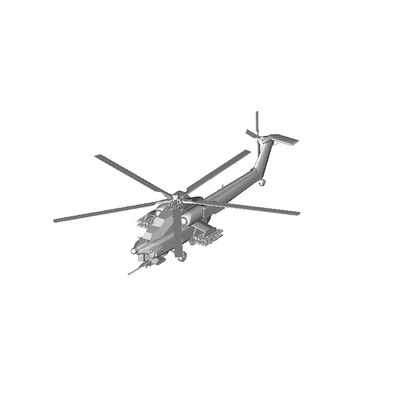

For the moss scene, five copies of the whole scene assembly in a row:

----
clone -i 1 -n 5 -t 150 0 0 all.g
r row.g u all.g u all.g1 u all.g2 u all.g3 u all.g4 u all.g5
----

The `-i 1` flag gives sequential integer suffixes so the result is
`all.g1` through `all.g5`.

.Six copies of the moss scene in a linear row (original + 5 clones, `clone -i 1 -n 5 -t 150 0 0 all.g`).
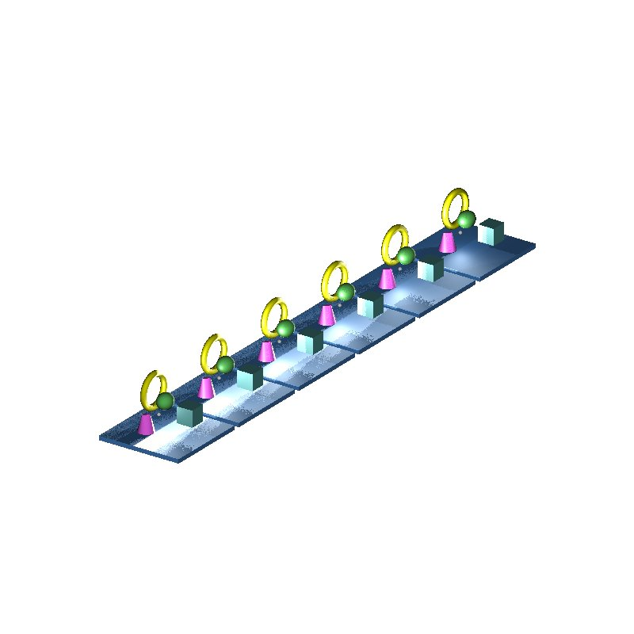

=== Total translation: -a

When you know where you want the _last_ copy to end up but not the
individual step size, use `-a n x y z` (total translation):

----
clone -a 4 300 0 0 ellipse.r
----

The total displacement of 300 mm is divided evenly over 4 copies, so
each copy is 75 mm further along X than the previous one.

.Four ellipse copies using total translation: `clone -a 4 300 0 0 ellipse.r`.
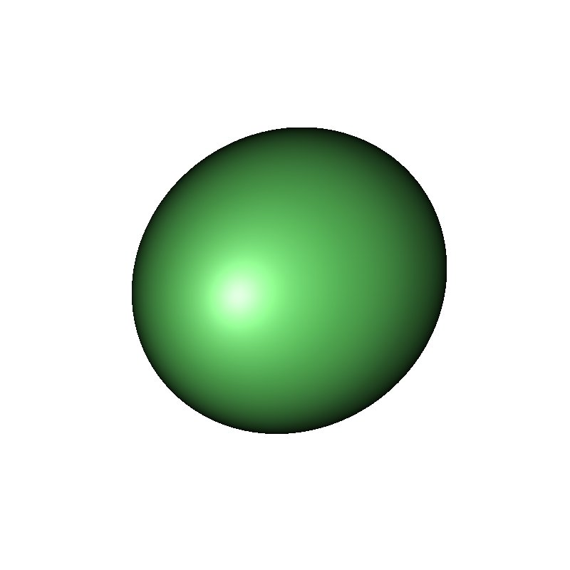

=== Per-copy rotation: -r and -b

The `-r x y z` option applies a per-copy rotation (in degrees about
the X, Y, Z axes) to each successive copy.  The pivot point defaults
to the origin; use `-p x y z` to move it.

----
clone -n 8 -r 0 0 45 box.r
----

This stacks eight copies of `box.r`, each rotated 45° further about
the Z axis than the previous one.  Looking straight down (-e 90) the
result shows the characteristic fan:

.Eight box copies, each rotated 45° about Z (top view): `clone -n 8 -r 0 0 45 box.r`.

.Same scene from an oblique view.
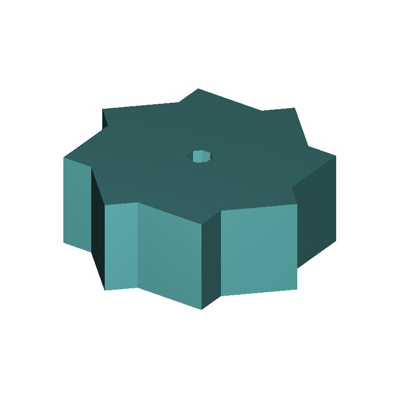

For total rotation (analogous to `-a`), use `-b n x y z`:

----
clone -b 4 180 0 0 part.r
----

Rotates four copies through a total of 180° about X, dividing the
angle evenly so each copy is 45° further than the previous.

=== Mirror: -m

The `-m axis d` option creates a single mirrored copy reflected about
the plane perpendicular to `axis` (x, y, or z) at offset `d` from the
origin.  This is the canonical way to model bilateral symmetry:

----
clone -m y 0 havoc
----

Mirrors the entire Havoc assembly about the Y=0 plane, producing a
left–right pair.  Viewed from the front the symmetry is immediately
apparent:

.Havoc helicopter and its Y-plane mirror image: `clone -m y 0 havoc`.
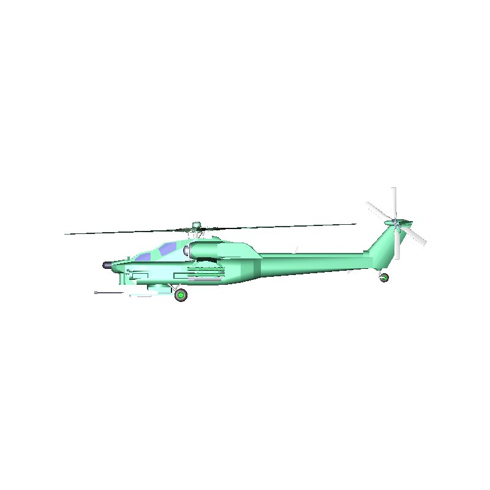

[[clone_rect]]
== Rectangular Grid Patterns

The `rect` pattern keyword places copies in a three-dimensional
rectangular lattice.  Its three axes are named *x*, *y*, and *z*.

----
clone rect -n x=4 -d x=9000 -n y=3 -d y=6000 widget
----

The bare value shorthand applies the same count and step to every axis
at once.  For a uniform 3×3×3 cube:

----
clone rect -n 3 -d 100 component
----

=== Platform grid example

The moss *platform.r* region copied into a 4×3 grid with 150 mm
spacing in both X and Y:

----
clone rect -n x=4 -d x=150 -n y=3 -d y=150 platform.r
----

.4×3 rectangular grid of platform copies: `clone rect -n x=4 -d x=150 -n y=3 -d y=150 platform.r`.
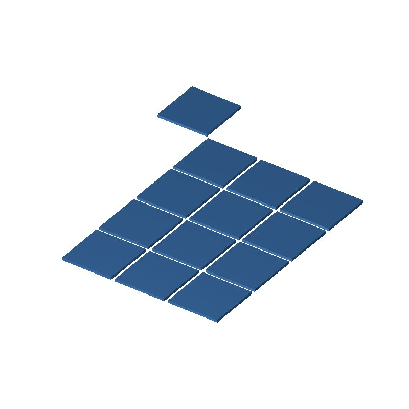

=== Helicopter fleet

For more dramatic scale, a 3×4 fleet of Havoc helicopters:

----
clone rect -n x=3 -d x=2200 -n y=4 -d y=2000 -n z=1 havoc
----

.3×4 formation of Havoc helicopters: `clone rect -n x=3 -d x=2200 -n y=4 -d y=2000 havoc`.
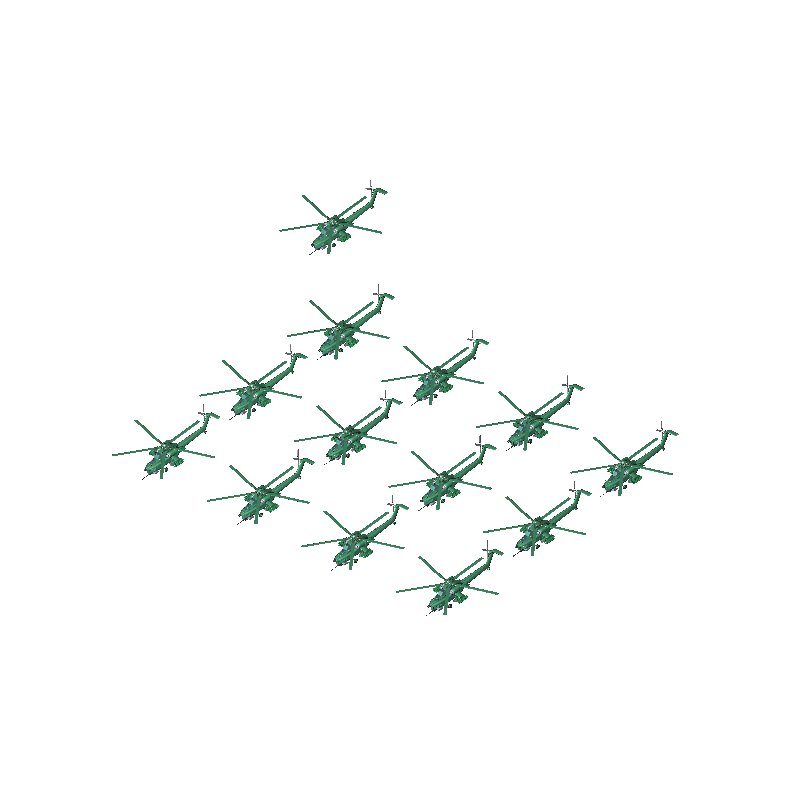

=== Using --dir to tilt grid axes

By default the three rect axes map to the global X, Y, Z unit vectors.
The `--dir AXIS x y z` option redirects any of them:

----
clone rect \
  --dir x 0.707 0.707 0 \
  --dir y -0.707 0.707 0 \
  -n x=3 -d x=100 -n y=3 -d y=100 component
----

This rotates the entire grid 45° about Z in model space — useful when
the part's natural orientation is not aligned with the global axes.

=== Grouping copies with -g

When you want to collect all copies into a named combination for later
drawing or raytracing, add `-g group_name`:

----
clone rect -n x=4 -d x=150 -n y=3 -d y=150 -g bolt_grid.c bolt.r
----

After the command completes, `draw bolt_grid.c` shows all twelve copies
at once without having to enumerate them individually.

[[clone_sph]]
== Spherical Patterns

The `sph` pattern keyword places copies on the surface of a sphere
parametrised by *azimuth* (az), *elevation* (el), and *radius* (r).
The sphere's centre defaults to the model origin; set it with
`-O x y z`.

=== Single equatorial ring

Eight cones equally spaced around the equator at radius 80 mm:

----
clone sph -n az=8 -d az=45 -n el=1 --start el=0 -n r=1 --start r=80 cone.r
----

`--start r=80` places the single radial layer at r=80 instead of the
default r=0 (which would pile all copies at the origin).
`--start el=0` centres the layer on the equator.

.Eight cones in an equatorial ring: `clone sph -n az=8 -d az=45 -n el=1 --start el=0 -n r=1 --start r=80 cone.r`.
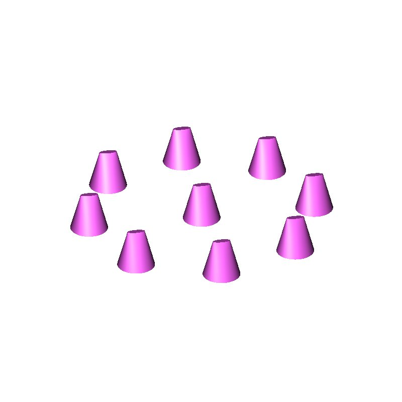

=== Two-shell hemisphere

Combining two elevation bands and two radii produces a sparse
spherical shell that illustrates the full three-axis composition:

----
clone sph \
  -n az=6 -d az=60 \
  -n el=2 -d el=60 --start el=-30 \
  -n r=2  -d r=40  --start r=60 \
  cone.r
----

This creates 6×2×2 = 24 copies arranged in two concentric shells, each
shell having two latitude bands of six items:

.6-azimuth × 2-elevation × 2-radius spherical distribution: `clone sph -n az=6 -d az=60 -n el=2 -d el=60 --start el=-30 -n r=2 -d r=40 --start r=60 cone.r`.
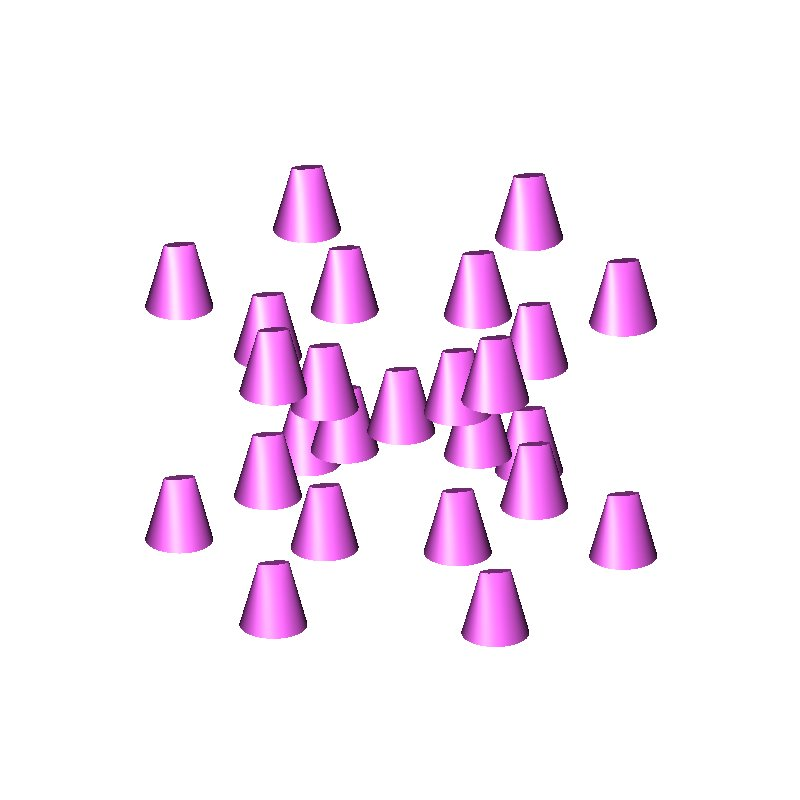

=== Axis values and their defaults

[cols="1,2,2"]
|===
|Axis |Default start |Default step meaning

|*az*
|0° (positive X direction)
|Degrees eastward from the reference direction (set with `--dir az x y z`)

|*el*
|−90° (south pole)
|Degrees above the equator; 0 = equator, +90 = north pole

|*r*
|0 (origin)
|Model-space distance from the centre; use `--start r=N` to set a non-zero layer
|===

[TIP]
====
The south-pole default for elevation means `clone sph -n az=8 -d az=45 -n r=1
--start r=80 obj` will put a single copy at the south pole — not eight
copies around the equator.  Add `--start el=0` (or any non-pole value)
when you want an equatorial ring.
====

=== Orientation alignment: --align az

The `--align az` flag yaws each copy so that its local X axis points
along the azimuthal tangent at its position — the direction in which
azimuth increases.  `--align az,el` additionally pitches each copy to
follow the elevation gradient.  These flags correspond to the old
`--rotaz` and `--rotel` flags.

----
clone sph -n az=8 -d az=45 -n el=1 --start el=0 -n r=1 --start r=80 \
          --align az cone.r
----

Without `--align` all cones keep their original orientation; with it
each cone's front face points along the circle.

[[clone_cyl]]
== Cylindrical Patterns

The `cyl` pattern keyword distributes copies around a cylinder
parametrised by *azimuth* (az), *radius* (r), and *height* (h).  The
cylinder axis defaults to the global Z direction; change it with
`--dir h x y z`.  The azimuth reference direction defaults to +X;
change it with `--dir az x y z`.

=== Ring around a cylinder

Eight cones equally spaced in azimuth at radius 80 mm, single height
layer:

----
clone cyl -n az=8 -d az=45 -n r=1 --start r=80 -n h=1 --start h=0 cone.r
----

.Eight cones arranged in a cylindrical ring: `clone cyl -n az=8 -d az=45 -n r=1 --start r=80 -n h=1 cone.r`.
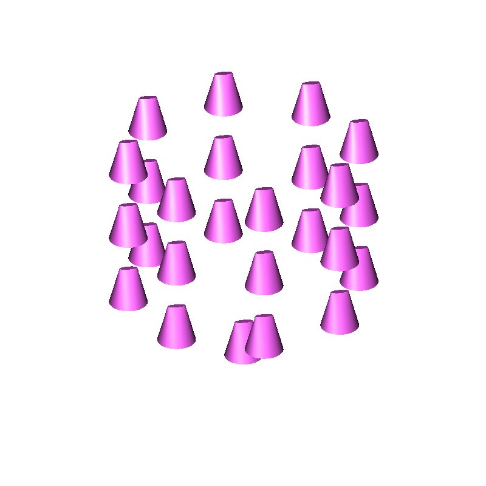

=== Stacked rings

Adding multiple height layers creates a helical or grid arrangement.
Six cones around, four height steps, each 40 mm apart:

----
clone cyl \
  -n az=6 -d az=60 \
  -n r=1  --start r=80 \
  -n h=4  -d h=40 --start h=0 \
  cone.r
----

.6×4 cylindrical tower of cones: `clone cyl -n az=6 -d az=60 -n r=1 --start r=80 -n h=4 -d h=40 cone.r`.
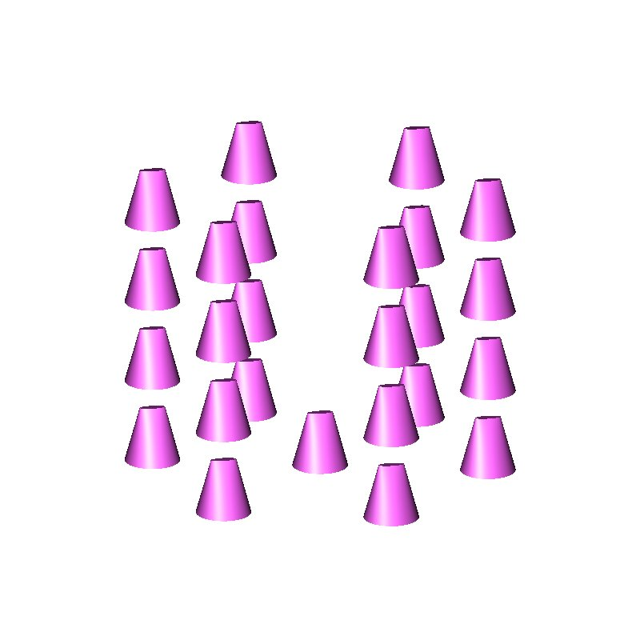

=== Havoc helicopter circle

For the most dramatic illustration, six Havoc helicopters arranged in
a circle of radius 3,500 mm:

----
clone cyl -n az=6 -d az=60 -n r=1 --start r=3500 -n h=1 --start h=0 havoc
----

.Six Havocs in a cylindrical ring (top view): `clone cyl -n az=6 -d az=60 -n r=1 --start r=3500 havoc`.
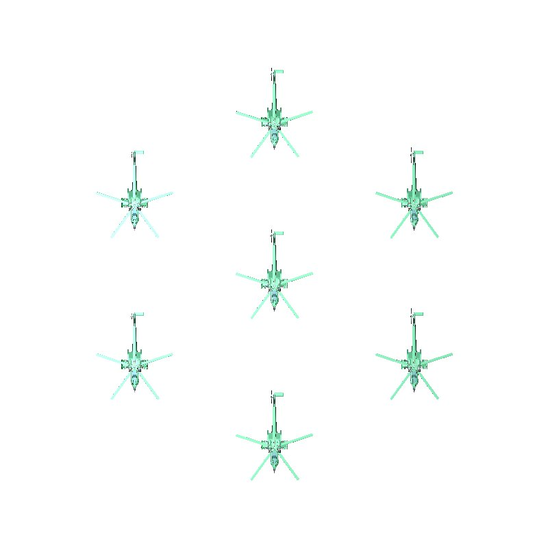

And a fleet of six in a rectangular 3×2 grid for comparison:

.3×2 Havoc fleet (rectangular pattern): `clone rect -n x=3 -d x=2200 -n y=2 -d y=2000 havoc`.
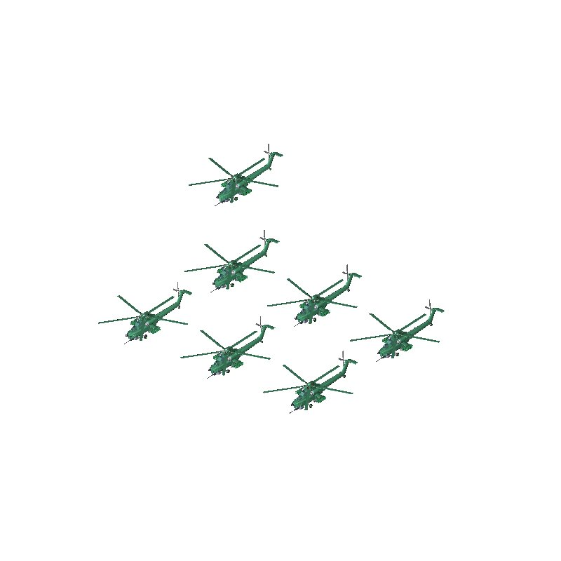

=== Orientation alignment: --align az

The `--align az` (also accepted as `--align tan`) flag yaws each copy
so that the object's X axis follows the azimuthal direction at its
cylinder position.  This is the old `--rot` behaviour:

----
clone cyl -n az=8 -d az=45 -n r=1 --start r=3500 -n h=1 \
          --align az havoc
----

Each helicopter now faces along the tangent to the ring instead of
pointing in its original direction.

[[clone_advanced]]
== Advanced Options

=== String substitution: -s / --subs

The `-s from to` option replaces the first occurrence of _from_ with
_to_ in every generated object name.  This is invaluable for creating
symmetric pairs — the classic "copy left side, rename to right side"
workflow:

----
clone -m y 0 -s l_ r_ left_door.r
----

This mirrors `left_door.r` about Y=0 and names the result
`right_door.r` (and renames all of its descendant primitives
accordingly).  Without `-s` the mirrored copy would be named
`left_door.r100`, which is semantically wrong.

The following example clones four copies of `cone.r` but renames the
`cone` fragment to `tcone` throughout the hierarchy:

----
clone -n 4 -t 150 0 0 -s cone tcone cone.r
----

.Four copies with name substitution `cone` → `tcone`: `clone -n 4 -t 150 0 0 -s cone tcone cone.r`.
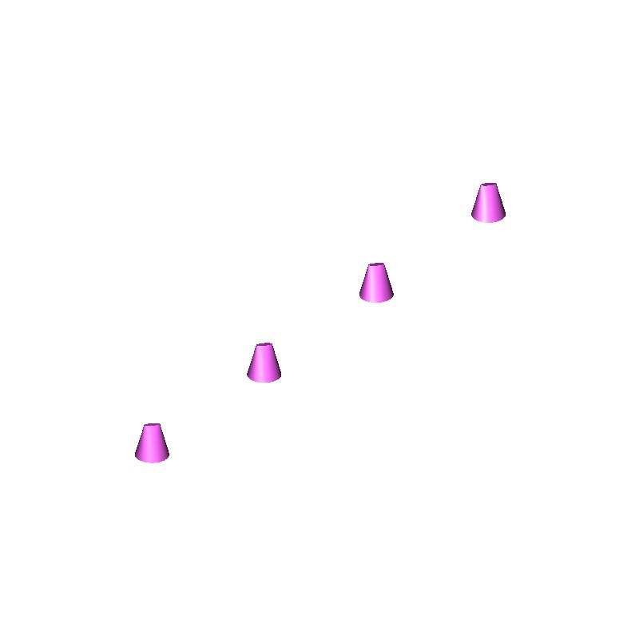

=== The group option: -g

Collect all produced copies (and optionally the original) into a named
combination:

----
clone rect -n x=4 -d x=100 -n y=4 -d y=100 -g grid_4x4.c tile.r
----

After this command, `r assembly.g u grid_4x4.c` adds the whole grid
as a single member, which is much cleaner than listing sixteen
individual copies.

=== Positioning the pattern origin: -O

By default all patterns are centred on the model origin.  The
`-O x y z` option moves the pattern origin in model space:

----
clone sph -n az=6 -d az=60 -n el=1 --start el=0 -n r=1 --start r=80 \
          -O 500 0 200 cone.r
----

The sphere is now centred at (500, 0, 200) in model space rather than
the origin.  For `cyl`, `-O` sets the centre of the cylinder base
disk.  For `rect`, `-O` sets the grid origin (i.e. where the
first copy lands).

=== The pivot for rotation: -p

The `-p x y z` option moves the pivot point around which rotations
and alignments are applied.  In linear mode this is the exact
equivalent of the historical `--rpoint` option:

----
clone -n 6 -r 0 0 60 -p 0 0 0 blade.r
----

Rotates six copies of `blade.r` around the origin in 60° steps —
the classic helicopter rotor construction.

=== The xpush option

The `--xpush` flag pre-flattens any instance matrices that hang above
the combination members of the source object before cloning.  It is
the replacement for the historical `xclone` workaround and is useful
when `-t`/`-r` do not behave as expected because of pre-existing
placement matrices in the hierarchy:

----
clone --xpush -n 4 -t 100 0 0 assembly_with_matrices.g
----

=== The --list option for irregular spacing

When you need non-uniform spacing along an axis, `--list AXIS="v1 v2
..."` overrides the regular step sequence with an explicit list of
values:

----
clone rect --list "x=0 50 150 300" -n y=3 -d y=100 fastener.r
----

X positions are 0, 50, 150, and 300 mm (four copies); Y runs
uniformly.  The `--list` value count overrides any `-n` count for
that axis.

[[clone_workflow]]
== Practical Workflow: Building a Wheel Assembly

This section walks through a realistic workflow: building an M35 truck
axle from a single wheel region by cloning it across the axle.

Suppose the wheel geometry is in `wheel.r` and its centreline lies on
the Z axis at Y=0.  The axle spans from Y=−900 mm to Y=+900 mm, with
the inner and outer dual-wheel positions at ±350 mm and ±850 mm.

[source]
----
# Four-wheel dual arrangement
# Mirror the inner wheel to the right side
clone -m y 0 -s l_ r_ l_wheel_inner.r

# Mirror the outer wheel
clone -m y 0 -s l_ r_ l_wheel_outer.r

# Collect into axle assembly
r axle.g \
  u l_wheel_inner.r \
  u r_wheel_inner.r \
  u l_wheel_outer.r \
  u r_wheel_outer.r
----

Then repeat for the rear axle by translating the whole assembly:

[source]
----
clone -n 1 -t 0 4500 0 axle.g
r full_undercarriage.g u axle.g u axle.g100
----

The same principles scale to any symmetric mechanical assembly.

[[clone_patterns_summary]]
== Pattern Reference Card

The following table summarises all axes, their default start values,
and what each `--dir` setting controls.

[cols="1,1,1,2,2"]
|===
|Pattern |Axis |Default start |`-d` units |`--dir` control

|`lin`
|step
|—
|model units
|direction of translation vector

|`rect`
|x, y, z
|0
|model units
|each grid axis direction (default: global X, Y, Z)

|`sph`
|az
|0°
|degrees
|reference direction for azimuth=0 (default: +X)

|`sph`
|el
|−90°
|degrees
|implicit (orthogonal to az and r)

|`sph`
|r
|0
|model units
|implicit (radially outward)

|`cyl`
|az
|0°
|degrees
|reference direction for azimuth=0 (default: +X)

|`cyl`
|r
|0
|model units
|implicit (radially outward)

|`cyl`
|h
|0
|model units
|cylinder axis direction (default: +Z)
|===

=== Alignment keys per pattern

[cols="1,2,3"]
|===
|Pattern |Valid `--align` keys |Effect

|`sph`
|*az*
|Yaw each copy so its +X points in the azimuthal direction

|`sph`
|*az,el*
|Yaw and pitch to follow the sphere surface

|`cyl`
|*az* (or *tan*)
|Yaw each copy to face the azimuthal tangent

|`lin`, `rect`
|(none; parser warns)
|No orientation change
|===

[[clone_tips]]
== Tips and Common Pitfalls

=== Radius must be non-zero for spherical and cylindrical patterns

If you run `clone sph -n az=8 -d az=45 -n r=1 obj` without specifying
`--start r=N`, the single radial position is at r=0 (the origin) and
all eight copies land at the same point.  Always set `--start r=N` for
any layer you want to appear at a non-zero radius.

=== Use --depth regions for bolt-hole patterns in castings

When you clone a bolt hole through a casting that is modelled as a
region, use `--depth regions` so that each cloned hole gets its own
region identifier and can be independently referenced during
raytracing.

=== The pattern keyword can appear anywhere

`clone -n 4 rect -d 100 widget` and `clone rect -n 4 -d 100 widget`
are identical.  The one-pass pre-scan removes the keyword before option
parsing, so its position relative to the flags never matters.  This
makes it easy to add a pattern keyword to an existing linear invocation
without rearranging the command.

=== Bare -n/-d sets a default for every axis

`clone rect -n 3 -d 100 widget` produces a 3×3×3 grid with 100 mm
spacing in all three directions — equivalent to spelling out
`-n x=3 -d x=100 -n y=3 -d y=100 -n z=3 -d z=100`.  You only need
the explicit `AXIS=value` form when different axes need different
values.

=== Position-independence makes scripting easy

Because `clone` is order-independent around its pattern keyword, Tcl
scripts can build the command list incrementally and simply prepend or
append the keyword without worrying about field ordering:

[source,tcl]
----
set clone_cmd [list rect --depth top -g my_group.c]
lappend clone_cmd -n x=4 -d x=$pitch_x
lappend clone_cmd -n y=3 -d y=$pitch_y
lappend clone_cmd $object_name
eval clone $clone_cmd
----

[[clone_see_also]]
== See Also

* `clone(nged)` — the full reference man page for all options
* `cp(nged)` — single-copy duplicate
* `xpush(nged)` — matrix flattening (used by `--xpush` internally)
* `r(nged)` — build region combinations from copies
* `draw(nged)` — display objects in the current view

== Author

BRL-CAD Team

== Copyright

This software is Copyright (c) 1995-2025 by the United States
Government as represented by U.S. Army Research Laboratory.

== Bug Reports

Reports of bugs or problems should be submitted via electronic
mail to <devs@brlcad.org>
